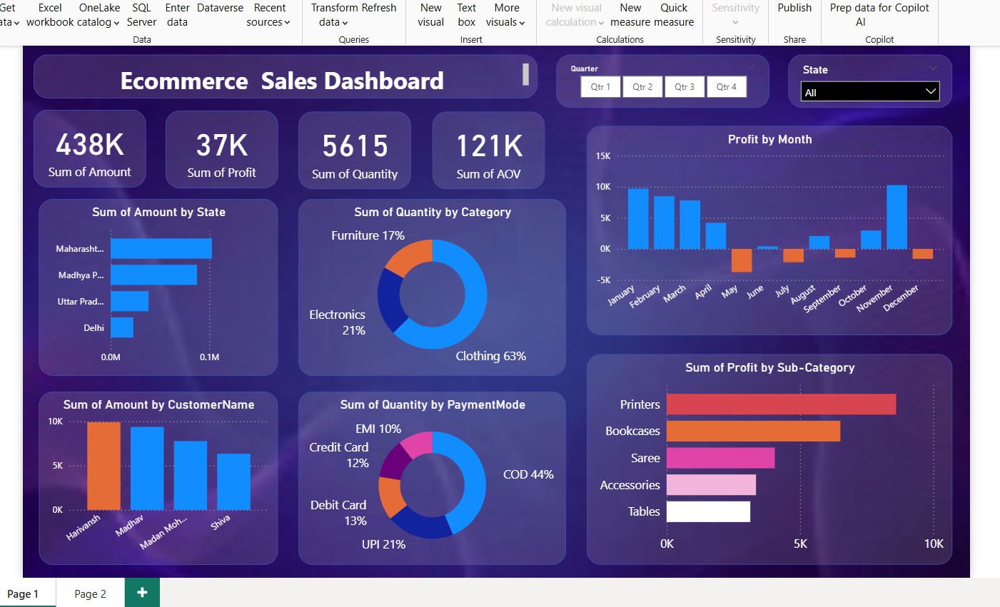

# PowerBI-Ecommerce-Analysis

This project presents a fully interactive and data-driven **Ecommerce Sales Dashboard** created using **Power BI**. It helps in understanding customer behavior, regional trends, and product performance to support **data-based decision-making** in ecommerce business operations.

---

##  Project Objective

The goal of this project is to **analyze and visualize ecommerce data** from Orders and Product Details, offering business users the ability to:
- Monitor key KPIs (sales, profit, quantity sold, AOV)
- Analyze **sales performance by region and customer**
- Understand **popular product categories and sub-categories**
- Track **monthly profit trends**
- Evaluate **preferred payment modes**

---

##  Key Dashboard Insights

- ** KPI Cards:**
  -  Total Sales: ₹438K
  -  Total Profit: ₹37K
  -  Quantity Sold: 5615
  -  Average Order Value (AOV): ₹121K

- ** Regional Performance:**
  - Top States by Sales: Maharashtra, Madhya Pradesh, Uttar Pradesh

- ** Top Customers:**
  - Harinarayan and Madhu are high-value customers by order value

- ** Category Performance:**
  -  Clothing: 63% of total quantity sold  
  -  Electronics: 21%  
  -  Furniture: 17%

- ** Payment Mode Distribution:**
  - COD (Cash on Delivery): 44%
  - UPI: 21%
  - Debit Card: 13%
  - Credit Card: 12%
  - EMI: 10%

- ** Profit Trends (Monthly):**
  - Highest profits in January, March, and November  
  - Negative profit in May, June, and December – needs attention

- ** Sub-category Profit:**
  - Printers and Bookcases are top-performing  
  - Sarees, Accessories, and Tables have relatively lower profit margins

- **🎛 Interactive Filters:**
  - Quarter and State slicers for drilling down into specific views

---

##  Files Included

| File Name                 | Description                             |
|--------------------------|-----------------------------------------|
| `Ecommerce_Sales_Dashboard.pbix` | Power BI dashboard file             |
| `Orders.csv`             | Contains order, customer, and transaction data |
| `Details.csv`            | Contains product category & sub-category data |
| `PBI_Dashboard_SS.png`   | Screenshot of the Power BI dashboard     |
| `README.md`              | Project documentation (this file)        |

---

##  Dashboard Preview

---

##  Business Questions Answered

- Who are my top customers?
- What product categories are most popular?
- Which regions are generating the highest sales?
- What is the monthly trend of profit and loss?
- Which payment modes are preferred by customers?
- Which sub-categories are contributing the most to profit?

---

##  Tools & Technologies Used

- Power BI Desktop
- CSV files for data import
- Data modeling and relationships
- Interactive visualizations

---

